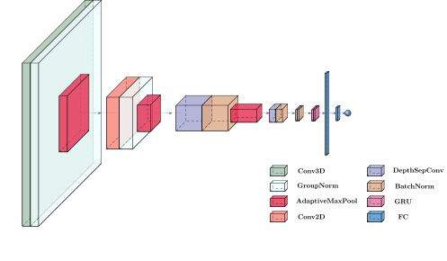

# ConvGRU-Driver Distraction Detection
This code is the official implementation of the paper 'A lightweight ConvGRU network for distracted
driving detection'. 
<h1> Purpose </h1>

The process of driving is one of the most common ones in the daily lives of many people. Therefore, it is crucial for it to be as safe as possible so that road accidents are kept to a minimum. Here, a lightweight architecture consisting of 3D and 2D depthwise separable convolutions is proposed as a solution to predict and counter the problem of distracted driving. Evalutation of the model was done in the Driver Anomaly Detection (DAD) dataset while the final models are stored in the following link: 
<a href="https://drive.google.com/drive/folders/1FsBKojWFX8RFeqH5uYn_E2W6Ct_05vbP?usp=sharing"> Trained Models </a>

<h1> Architecture </h1>
The proposed architecture is the neural model ConvGRU which combines one 3D convolution with 2D depthwise seperable ones, leading to a very lightweight neural architecture. A recurrent neural model is then responsible for capturing the time correlations between the features and finally a classifier produces the final decision.

